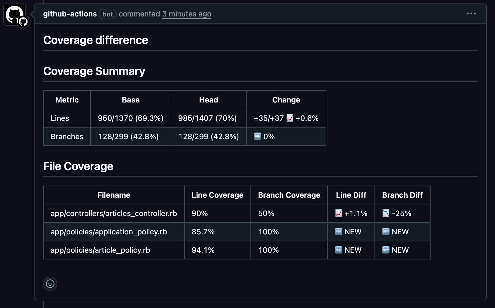

# SimpleCov Resultset Diff


Creates a comment inside your Pull-Request with the difference between two SimpleCov resultset files.



## Usage

To use this Github action, in your steps you may have:

```yml
uses: nittarab/simplecov-resultset-diff-action@v1
with:
  base-resultset-path: '/path/to/my/.resultset.json'
  head-resultset-path: '/path/to/my/.resultset.json'
  token: ${{ secrets.GITHUB_TOKEN }}
```

## Inputs

| Inputs              | Required | Default | Description                                                                                                                           |
| ------------------- | -------- | ------- | ------------------------------------------------------------------------------------------------------------------------------------- |
| base-resultset-path | true     |         | Path to the SimpleCov generated ".resultset.json" file from the base branch.                                                          |
| head-resultset-path | true     |         | Path to the SimpleCov generated "resultset.json" file from the head branch.                                                           |
| token               | false    |         | Github token so the package can publish a comment in the pull-request. If not provided, runs in dry-run mode (useful for CI testing). |

## Dry-Run Mode

You can run the action in dry-run mode by setting the `DRY_RUN` environment variable to `true` or `1`. In dry-run mode, the action will calculate and log the coverage diff but won't post any comments to the PR.

```yml
- name: Coverage Diff (Dry Run)
  uses: nittarab/simplecov-resultset-diff-action@v1
  env:
    DRY_RUN: true
  with:
    base-resultset-path: base-result/.resultset.json
    head-resultset-path: head-result/.resultset.json
    token: ${{ secrets.GITHUB_TOKEN }}
```

This is useful for testing the action or when you want to see the coverage diff without posting comments.

## Usage example

If you want to compare the coverage difference between your base branch and your pull-request head branch.

You'll need to run your test and collect coverage for the head branch:

```yml
on:
  pull_request:

jobs:
  build-head:
    name: 'Build head'
    runs-on: ubuntu-latest
    steps:
      - uses: actions/checkout@v2
      - uses: ruby/setup-ruby@v1
        with:
          bundler-cache: true
      - name: Run test
        run: bundle exec rspec
```

Then we will use the Github Actions feature
called "[artifacts](https://help.github.com/en/actions/automating-your-workflow-with-github-actions/persisting-workflow-data-using-artifacts)"
to store that `.resultset.json` file.

```yml
- name: Upload coverage report
  if: always()
  uses: actions/upload-artifact@v2
  with:
    name: head-result
    path: coverage/.resultset.json
```

Now you can do the exact same thing, but for the base branch. Note the checkout step!

```yml
build-base:
  name: 'Build base'
  runs-on: ubuntu-latest
  steps:
    - uses: actions/checkout@v2
      with:
        ## Here we do not checkout the current branch, but we checkout the base branch.
        ref: ${{ github.base_ref }}
    - uses: ruby/setup-ruby@v1
      with:
        bundler-cache: true
    - name: Run test
      run: bundle exec rspec
    - name: Upload coverage report
      if: always()
      uses: actions/upload-artifact@v2
      with:
        name: base-result
        path: coverage/.resultset.json
```

Now, in a new job we can retrieve both of our saved resultset from the artifacts and use this action to compare them.

```yml
compare:
  name: 'Compare base & head coverages'
  runs-on: ubuntu-latest
  needs: [build-base, build-head]

  steps:
    - name: Download base artifact
      uses: actions/download-artifact@v1
      with:
        name: base-result

    - name: Download head artifact
      uses: actions/download-artifact@v1
      with:
        name: head-result

    - uses: nittarab/simplecov-resultset-diff-action@v1
      with:
        base-resultset-path: ./base-result/.resultset.json
        head-resultset-path: ./head-result/.resultset.json
        token: ${{ secrets.GITHUB_TOKEN }}
```

That's it! When the compare job will be executed, it will post a comment in the current pull-request with the difference
between the two resultset files.

## Cache .resultset.json

You can use the cached resultset file for comparison. To cache the resultset file that generated from the `build-base`
job, it will save the build time.

```yml
build-base:
  name: 'Build base'
  runs-on: ubuntu-latest
  steps:
    - uses: actions/checkout@v2
      with:
        ref: ${{ github.base_ref }}

    - id: base-ref-commit
      run: echo "::set-output name=revision::`git rev-parse HEAD`"

    - name: simplecov resultset cache
      id: simplecov-resultset
      uses: actions/cache@v2
      with:
        path: coverage/.resultset.json
        key: simplecov-resultset-${{ steps.base-ref-commit.outputs.revision }}

    - uses: ruby/setup-ruby@v1
      if: steps.simplecov-resultset.outputs.cache-hit != 'true'
      with:
        bundler-cache: true

    - name: Run test
      if: steps.simplecov-resultset.outputs.cache-hit != 'true'
      run: bundle exec rspec

    - name: Upload coverage report
      if: always()
      uses: actions/upload-artifact@v2
      with:
        name: base-result
        path: coverage/.resultset.json
```

## Development

### Running Tests

To run the unit tests:

```bash
npm test
```

To run tests with coverage:

```bash
npm run coverage
```

### Building the Action

To build and package the action:

```bash
npm run bundle
```

This will format, lint, test, generate coverage, and package the action.

For development with auto-rebuilding:

```bash
npm run package:watch
```

### CI/CD

The project uses an improved CI pipeline that:

- **Tests across multiple Node.js versions** (18, 20, 22) and operating systems
- **Separates concerns** with dedicated jobs for testing, building, and integration testing
- **Avoids posting confusing comments** during CI by using dry-run mode for integration tests
- **Validates the build** is up-to-date and properly formatted
- **Generates coverage reports** and badges automatically

### Dry-Run Mode

The action supports dry-run mode when no token is provided, which is useful for:

- Testing the action logic without posting comments
- CI/CD validation without side effects
- Local development and debugging

Example dry-run usage:

```yml
- uses: ./
  with:
    base-resultset-path: ./fixtures/base.json
    head-resultset-path: ./fixtures/head.json
    # No token provided = dry-run mode
```

## License

MIT
